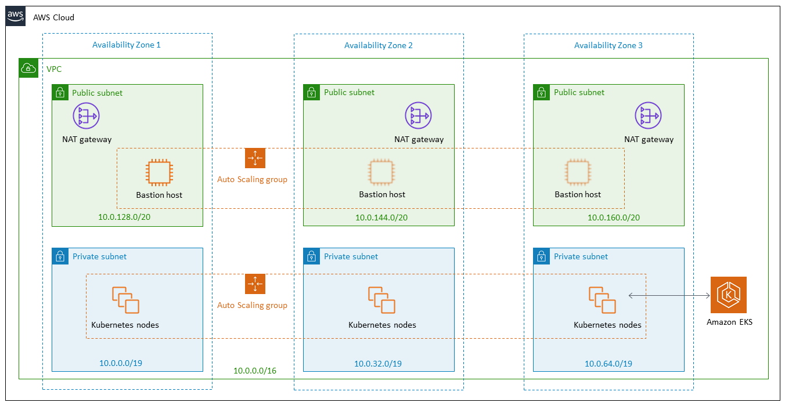

# Provisioning an EKS Cluster

Provisioning an EKS cluster for my final year project.

## Table of contents

- [EKS Architecture](#eks-architecture)
- [Create the VPC and subnets](#create-the-vpc-and-subnets)
- [Create the cluster](#create-the-cluster)
- [Launch the worker nodes](#launch-the-worker-nodes)
- [Launch the dashboard](#launch-the-dashboard)

## EKS Architecture



- 3 Public subnets
- 3 Private subnets (which host the Kubernetes worker nodes)

## Create the VPC and subnets

1. Create a new VPC called `fyp-vpc`
2. Create 3 public subnets with the following CIDRs (in 3 different availability zones):
   - 10.0.0.0/24
   - 10.0.1.0/24
   - 10.0.2.0/24
3. Create 3 private subnets with the following CIDRs (in 3 different availability zones):

   - 10.0.3.0/24
   - 10.0.4.0/24
   - 10.0.5.0/24
     Each private subnet should also be tagged with `kubernetes.io/role/internal-elb:1`

4. Finally, create an `fyp-control-plane` security group for the VPC, which is applied to the Kubernetes master node later. No special rules need to be added, since this is done by the CloudFormation stack when creating the worker nodes.

Reference:

- https://docs.aws.amazon.com/eks/latest/userguide/create-public-private-vpc.html
- https://docs.aws.amazon.com/eks/latest/userguide/network_reqs.html

## Create the cluster

1. Firstly create an EKS IAM role, to allow Kubernetes to create AWS resources. Permissions are added by default when the type of trusted entity is `AWS Service > EKS`. This role is called `EKSServiceRole`.
2. Create the cluster using the following command (if necessary first run `aws configure` from the command line). For `subnetIds` both the private and public subnet ids should be passed in:

```sh
aws eks --region eu-west-1 create-cluster \
--name fyp \
--role-arn <EKSServiceRole-arn> \
--resources-vpc-config subnetIds=<all-subnet-ids>,securityGroupIds=<fyp-control-plane-security-group-id>
```

3. Configure kubectl to connect to the EKS cluster:

```sh
aws eks --region eu-west-1 update-kubeconfig --name fyp
```

Run a test to ensure this is working:

```sh
kubectl get svc

NAME         TYPE        CLUSTER-IP   EXTERNAL-IP   PORT(S)   AGE
kubernetes   ClusterIP   172.20.0.1   <none>        443/TCP   1h
```

Reference:

- https://docs.aws.amazon.com/eks/latest/userguide/getting-started.html

## Launch the worker nodes

1. Once the cluster is active, launch the worker nodes from [this](https://amazon-eks.s3-us-west-2.amazonaws.com/cloudformation/2019-02-11/amazon-eks-nodegroup.yaml) CloudFormation template, following the guidelines in the AWS tutorial.
2. The node image id for EKS AMI in Ireland is `ami-098fb7e9b507904e7`.
3. For the worker node subnets, all private subnets should be selected.

Pricing for the EC2 instances follows [regular EC2 pricing](https://aws.amazon.com/ec2/pricing/on-demand/),
however the number of pods that can be deployed is restricted by the types of instances selected. I have around 30 pods, so I chose `t2.small` or `t2.medium` instances according to the amount of worker nodes I needed and the price of the instances.

The list with the amount of pods per instance can be found [here](https://github.com/awslabs/amazon-eks-ami/blob/master/files/eni-max-pods.txt).

Reference:

- https://docs.aws.amazon.com/eks/latest/userguide/getting-started.html#eks-launch-workers

## Launch the dashboard

Reference:

- https://docs.aws.amazon.com/eks/latest/userguide/dashboard-tutorial.html

## FYP Architecture

- Strimzi deployment
  - 3 Kafka replicas
  - 3 Zookeeper replicas
  - Cluster operator
  - Entity operator
- Kubeless deployment
  - Kubeless manager operator
- Kubernetes dashboard

### Running pods

```
NAMESPACE     NAME                                           READY   STATUS             RESTARTS   AGE
default       nginx-deployment-6fdbb596db-zfk6c              1/1     Running            0          41m
demo          kafka-consumer-f4cff8b79-v52mj                 1/1     Running            4          4m
demo          kafka-producer-5c77885465-fqgh6                1/1     Running            0          2m
kafka         my-cluster-entity-operator-584f777568-rvxsn    3/3     Running            0          8m
kafka         my-cluster-kafka-0                             2/2     Running            0          9m
kafka         my-cluster-kafka-1                             2/2     Running            0          9m
kafka         my-cluster-kafka-2                             2/2     Running            0          9m
kafka         my-cluster-zookeeper-0                         2/2     Running            0          10m
kafka         my-cluster-zookeeper-1                         2/2     Running            0          10m
kafka         my-cluster-zookeeper-2                         2/2     Running            0          10m
kafka         strimzi-cluster-operator-c8d786dcb-jjp79       1/1     Running            0          10m
kube-system   aws-node-2nf5q                                 1/1     Running            0          44m
kube-system   aws-node-4lwr8                                 1/1     Running            0          43m
kube-system   aws-node-8ndrt                                 1/1     Running            0          43m
kube-system   coredns-7554568866-lk94m                       1/1     Running            0          55m
kube-system   coredns-7554568866-zlg67                       1/1     Running            0          55m
kube-system   heapster-84c9bc48c4-qwrg9                      1/1     Running            0          15m
kube-system   kube-proxy-8pkhk                               1/1     Running            0          43m
kube-system   kube-proxy-ft5h5                               1/1     Running            0          44m
kube-system   kube-proxy-xhghc                               1/1     Running            0          43m
kube-system   kubernetes-dashboard-5dd89b9875-5swmq          1/1     Running            0          16m
kube-system   monitoring-influxdb-848b9b66f6-2r5ln           1/1     Running            0          15m
kubeless      kubeless-controller-manager-76b5c84b88-sj97h   3/3     Running            0          6m
```

### Deployments

```
NAMESPACE     NAME                          DESIRED   CURRENT   UP-TO-DATE   AVAILABLE   AGE
demo          kafka-consumer                1         1         1            0           6m
demo          kafka-producer                1         1         1            1           6m
kafka         my-cluster-entity-operator    1         1         1            1           10m
kafka         strimzi-cluster-operator      1         1         1            1           12m
kube-system   coredns                       2         2         2            2           57m
kube-system   heapster                      1         1         1            1           17m
kube-system   kubernetes-dashboard          1         1         1            1           17m
kube-system   monitoring-influxdb           1         1         1            1           17m
kubeless      kubeless-controller-manager   1         1         1            1           7m
```
