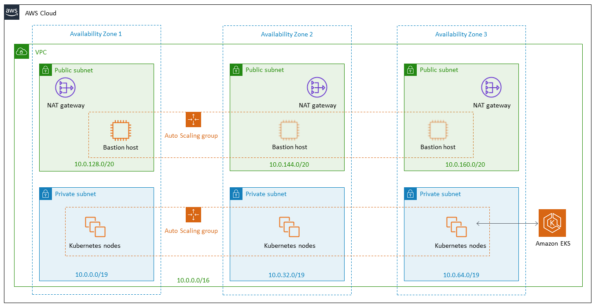

# Provisioning the cluster

These are the guidelines for creating the following EKS cluster:


## Create the VPC and subnets

1. Create a new VPC called `fyp-vpc`
2. Create 3 public subnets with the following CIDRs:
   - 10.0.0.0/24
   - 10.0.1.0/24
   - 10.0.2.0/24
3. Create 3 private subnets with the following CIDRs:

   - 10.0.3.0/24
   - 10.0.4.0/24
   - 10.0.5.0/24
     Each private subnet should also be tagged with `kubernetes.io/role/internal-elb:1`

4. Finally, create an `fyp-control-plane` security group for the VPC, which is applied to the Kubernetes master node later. No special rules need to be added, since this is done by the CloudFormation stack when creating the worker nodes.

Reference: https://docs.aws.amazon.com/eks/latest/userguide/create-public-private-vpc.html, https://docs.aws.amazon.com/eks/latest/userguide/network_reqs.html

## Create the cluster

1. Firstly create an EKS IAM role, to allow Kubernetes to create AWS resources. Permissions are added by default when the type of trusted entity is `AWS Service > EKS`. This role is called `EKSServiceRole`
2. Create the cluster using the following command (if necessary first run `aws configure` from the command line). For `subnetIds` both the private and public subnet ids should be passed in:

```sh
aws eks --region eu-west-1 create-cluster \
--name fyp \
--role-arn <EKSServiceRole-arn> \
--resources-vpc-config subnetIds=<subnet-ids>,securityGroupIds=<fyp-control-plane-security-group-id>
```

3. Configure kubectl to connect to the EKS cluster:

```sh
aws eks --region eu-west-1 update-kubeconfig --name fyp
```

Run a test to ensure this is working:

```sh
kubectl get svc

NAME         TYPE        CLUSTER-IP   EXTERNAL-IP   PORT(S)   AGE
kubernetes   ClusterIP   172.20.0.1   <none>        443/TCP   1h
```

Reference: https://docs.aws.amazon.com/eks/latest/userguide/getting-started.html
